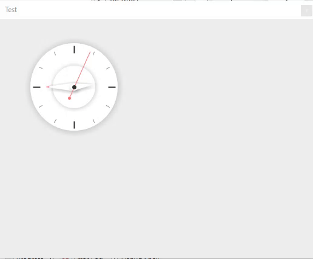
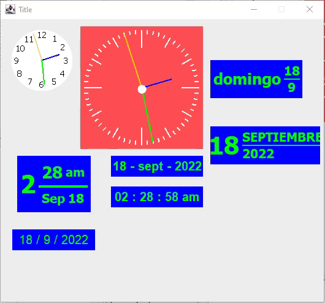

# LibSimpleClockPanel

- Use

~~~java

	Clock test= new Clock();

	SimpleClockPanel panel = new SimpleClockPanel(1f, Color.BLUE, Color.GREEN, Color.ORANGE, Color.BLACK,
				new Color(255, 78, 83));

	ClockPanel panel_1 = new ClockPanel(Color.BLUE, Color.GREEN, Color.ORANGE, Color.WHITE, new Color(255, 78, 83),
			200, 200);
	
	MaterialDigitalClock panel_2 = new MaterialDigitalClock(Color.BLUE, Color.GREEN, 20, Language.SPANISH, 1);
	
	MaterialDigitalClock panel_2_1 = new MaterialDigitalClock(Color.BLUE, Color.GREEN, 20, Language.SPANISH, 2);
	
	MaterialDigitalClock panel_2_1_1 = new MaterialDigitalClock(Color.BLUE, Color.GREEN, 20, Language.SPANISH, 3);
	
	MaterialDigitalClock panel_2_1_1_1 = new MaterialDigitalClock(Color.BLUE, Color.GREEN, 20, Language.SPANISH, 4);
	
	MaterialDigitalClock panel_2_1_1_2 = new MaterialDigitalClock(Color.BLUE, Color.GREEN, 20, Language.SPANISH, 5);
	
	MaterialDigitalClock panel_2_1_1_2_1 = new MaterialDigitalClock(Color.BLUE, Color.GREEN, 20, Language.SPANISH,
			6);
	
~~~