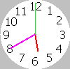
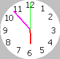
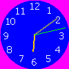

# LibSimpleClockPanel

- Use

~~~java

	SimpleClockPanel test = new SimpleClockPanel();

	test.setNumberColor(Color.WHITE);

	test.setCircleColor(Color.BLUE);

	test.setHourColor(Color.ORANGE);

	test.setMinuteColor(Color.GRAY);

	test.setSecondsColor(Color.GREEN);

	test.setBackground(Color.MAGENTA);

~~~