# ClockFace

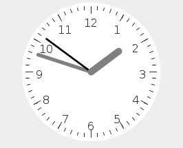

# ClockFace2

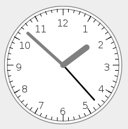

# ClockPanel

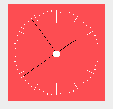

# DayText

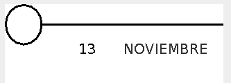

# DiaAgenda

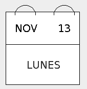

# FechaDia

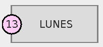

# MaterialDate

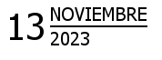

# ModernClock

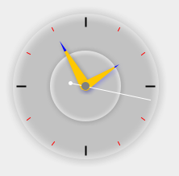

# SimpleClock

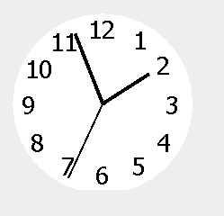

# SimpleDate

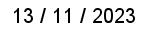

# SimpleDateText

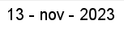

# SimpleDigitalClock

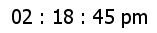

# TextClock

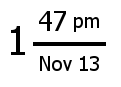

# TextDate

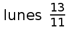

## Class MaterialDigitalClock

### Esta clase puede instanciar algunas de las clases anteriores mediante el contructor

~~~java

	MaterialDigitalClock panel = new MaterialDigitalClock(Color.BLUE, Color.GREEN, 20, false, 1);
	
~~~

### En el ejemplo anterior, el último parámetro indica el tipo de reloj que queremos.

### Tenemos estas opciones

-1 -> SimpleDigitalClock

-2 -> TextClock

-3 -> SimpleDate

-4 -> SimpleDateText

-5 -> TextDate

-6 -> MaterialDate

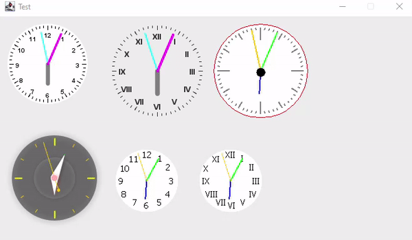

